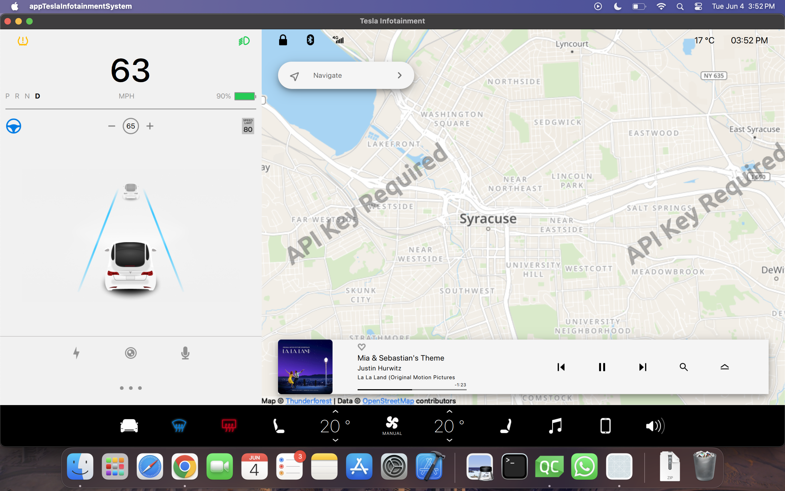

# Qt QML Application

## Description

This is a Qt QML application that demonstrates a user interface with a map, music bar, and other features.

## Features

* Map view with pinch and zoom functionality
* Music bar with playback controls
* UI elements with animations and effects

## Screenshot

## Building and Running

To build and run this application, you need to have Qt installed on your system. Open the project in Qt Creator and run it.

## License

This application is licensed under the GNU General Public License version 3.

## Contact

If you have any questions or need further assistance, please contact [Your Name] at [Your Email].
